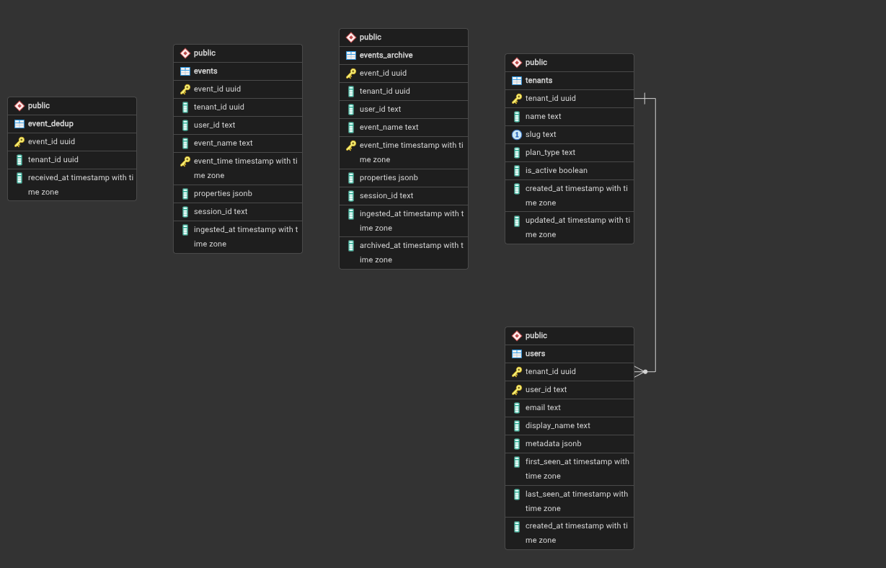

# Multi-Tenant Event Analytics System

A high-performance, scalable PostgreSQL-based analytics engine designed for multi-tenant applications. This system handles millions of events with strict tenant isolation, automated data lifecycle management, and real-time analytical insights.



## 🚀 Features

-   **Multi-Tenancy & Security:** Row Level Security (RLS) ensures that tenants can only access their own data.
-   **High-Volume Ingestion:** Partitioned `events` table (monthly) with deduplication logic and batch ingestion support.
-   **Advanced Analytics:**
    -   Daily Active Users (DAU) & 7-day rolling averages.
    -   Revenue tracking and summary.
    -   Conversion Funnels (e.g., signup -> add_to_cart -> purchase).
    -   Weekly Cohort Retention (Day 1 & Day 7).
-   **Performance Optimization:** Materialized Views for heavy aggregations with concurrent refresh support.
-   **Data Lifecycle Management:** Automatic archival of hot data (12+ months) to cold storage (`events_archive`) to maintain query performance.
-   **Robust Operations:**
    -   Automated partition management.
    -   Full and per-tenant backup/restore scripts with integrity verification.
    -   Maintenance scheduling via `pg_cron` or system `crontab`.
-   **Realistic Seed Data:** Python-based generator creating 1M+ events with power-law distributions.

## 📂 Project Structure

```text
├── sql/
│   ├── 01_schema.sql             # Core tables, RLS, and initial partitions
│   ├── 02_partitioning.sql       # Dynamic partition management functions
│   ├── 03_triggers.sql           # Validation and user activity syncing
│   ├── 04_ingestion.sql          # Ingestion procedures and deduplication
│   ├── 05_analytical_queries.sql # Core business metrics and funnels
│   ├── 06_advanced_queries.sql   # Complex insights and benchmarking
│   ├── 07_materialized_views.sql # Performance-optimized views
│   ├── 08_lifecycle.sql          # Archival and retention logic
│   └── 09_backup.sql             # Integrity checks and export procedures
├── scripts/
│   ├── backup.sh                 # Backup utility (full/schema/tenant)
│   ├── restore.sh                # Restore utility with verification
│   ├── Cron_Job.sql              # pg_cron maintenance schedule
│   └── crontab_clean.txt         # Standard Linux crontab example
├── seed/
│   └── generate_seed.py          # 1M event seed data generator
└── README.md
```

## 🛠️ Getting Started

### 1. Database Setup
Create a PostgreSQL database and apply the schema in order:

```bash
createdb analytics
for f in sql/*.sql; do psql -d analytics -f "$f"; done
```

### 2. Generate and Load Seed Data
Generate 1,000,000 realistic events:

```bash
cd seed/
python3 generate_seed.py
DB_URL=postgresql://localhost/analytics bash load_all.sh
```

### 3. Maintenance Setup
You can use `pg_cron` for in-database scheduling:

```bash
psql -d analytics -f scripts/Cron_Job.sql
```

Or use the standard system `crontab`:

```bash
crontab scripts/crontab_clean.txt
```

## 📊 Analytics
Key metrics are available via Materialized Views. To refresh them manually:

```sql
CALL refresh_daily_views();
CALL refresh_weekly_views();
```

## 💾 Backup & Restore
Back up the entire database:
```bash
bash scripts/backup.sh full
```

Restore and verify integrity:
```bash
bash scripts/restore.sh backups/full_...dump
```
